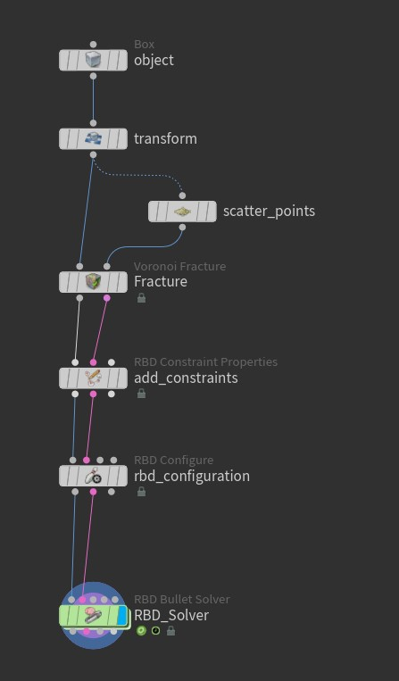
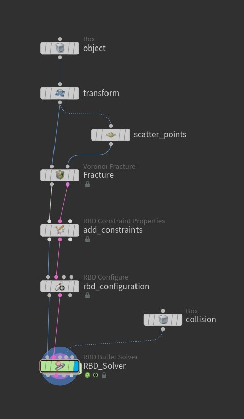
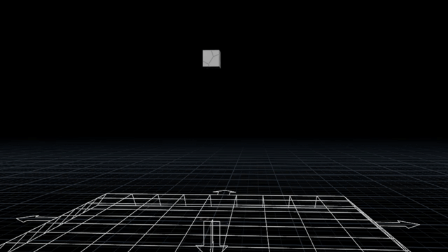
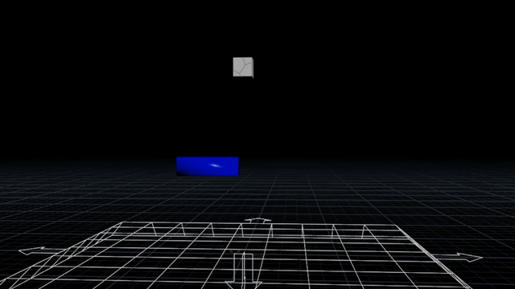
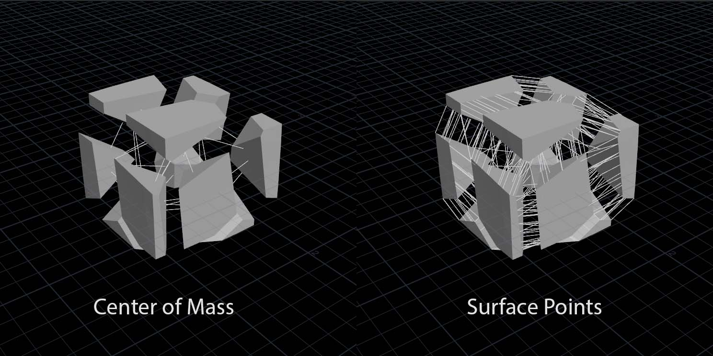
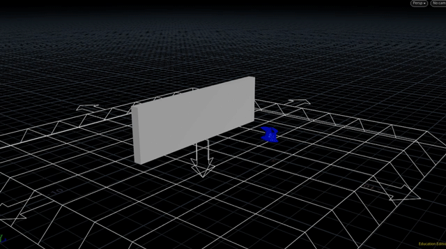
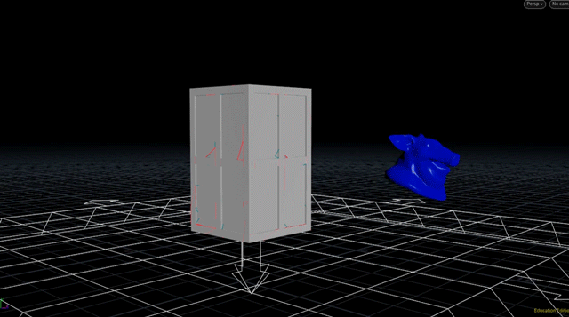

# RBD Guide 

A simple intro to RBD 

## RBD Basic Setup
<table border="0">
<tr>
<td><ol  style ="line-height: 27px;">
    <li>Object </li>
    <li>Scatter Points</li>
    <li>Fracture </li>
    <li>Add Constraints </li>
    <li>RBD Configuration</li>
    <li>RBD Solver </li>
    </ol>
</td>
<td> </td>
</tr>
</table>

### Challenge : 

- Set `add ground plane` to `Ground Plane` in `RBD_solver`
- Try changing `strength` parameter in `add_constraint` node and re-simulate
- Try adding a collision 

     </td>

## RBD Walk through 

- example_01_basic_setup
    > Walk through a basic RBD workflow.    
    
    <table border="0">
    <tr>
    <td></td></td>
    <td></td>
    </tr>
    </table>
- example_02_scattering
    > Different ways to scatter points.
- example_03_fracturing
    > Different ways to fracture.
- example_04_constraints
    > Explore Constraints Types.

    
- example_05_rbd_configuration
    > Basic RBD Configurations.

    
- example_06_rbd_solver
    > Explore rbd solver parameters,I left it empty for you to try.
- Case Study 
  - building_demolition_1, Full basic process
  
    
    
  - building_demolition_2, Full basic process with hint on **multi-fracture-levels**
  - More Advanced Building Demolition
    - I highly recommend this [Gnomon RBD Course](https://www.thegnomonworkshop.com/tutorials/controlled-building-demolition-fx-in-houdini), *my coursework is included in [hipflies](hipfiles/gnomon_building_demolition_my_coursework.zip)*

## Further Steps 

Once you became familiar with RBD nodes in Houdini, Give yourself some time to practice to a have solid skill in RBD.

you can explore RBD Courses like these: 

- [Destruction Fx | Side Fx Learn](https://www.sidefx.com/learn/destruction-fx/)
- [Mastering Destruction Fx | Rebelway](https://www.rebelway.net/mastering-destruction-and-fx-in-houdini)
- [Realistic Destruction Workflows | FX PHD](https://www.fxphd.com/details/627/)

Also, Consider searching for **Houdini RBD Workflows** to learn about different opinions in achieving RBD in Houdini.
e.g.

  - [Houdini Destruction | SideFx](https://www.sidefx.com/docs/houdini/destruction/index.html)
  - [RBD Workflows | katexagoraris](https://www.katexagoraris.com/misc-4/rbd-workflows-in-houdini)
  - [H18 RBD Workflow | FX TD](http://fxtd.free.fr/index.php/wiki/houdini-rbd-workflow-h18/)
  