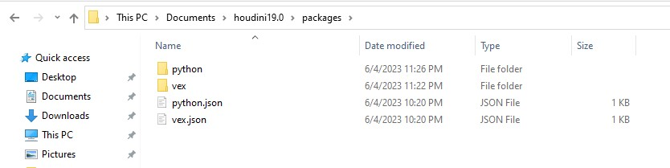

# Houdini Scripting Intro

>A prior knowledge of programming (or preferably computer science) will make your life easier.

If you don't already know Python, consider starting with a crash course in Python like [this one](https://github.com/mustafa-zarkash/Content-Creation/tree/main/Kids-Adolescents-Content/python-crash-course), or a full introductory course about python like [this one](https://www.coursera.org/learn/python). 

Every action, such as a mouse click or a keyboard key press, fires a command in Houdini.

So, scripting is like a shortcut to save time doing things manually.
This results in a higher level of interaction with Houdini as the details of doing these things are taken care of by scripts running in the background. 
Think of Houdini plugins as an example. 

This guide will be concered with : 
    
- **Vex** 
- **Python for Houdini** 

## Preparation 

```
The goal here is to tell houdini where to find our scripts.
Then we will put our python scripts in python folder, likewise vex scripts in vex folder.
```

Copy the contents of [packages](resources/packages) to `Documents/houdini_folder/packages` 



