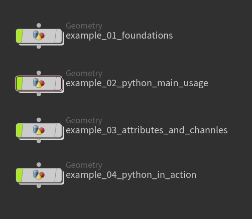
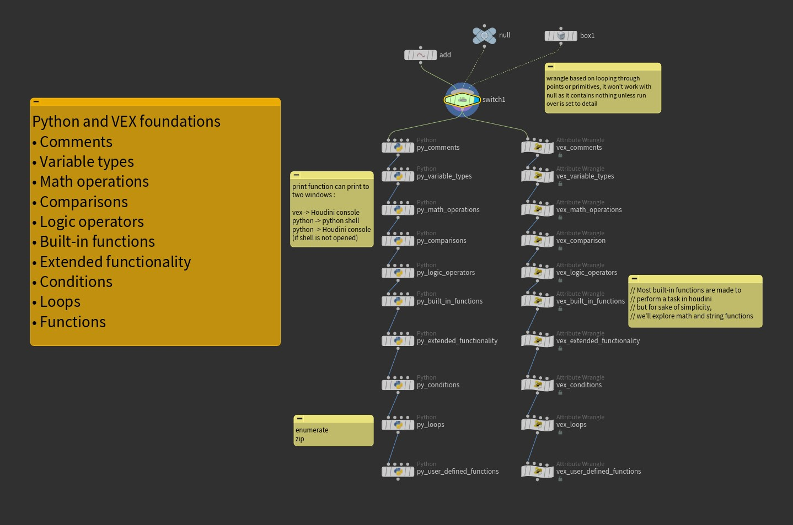
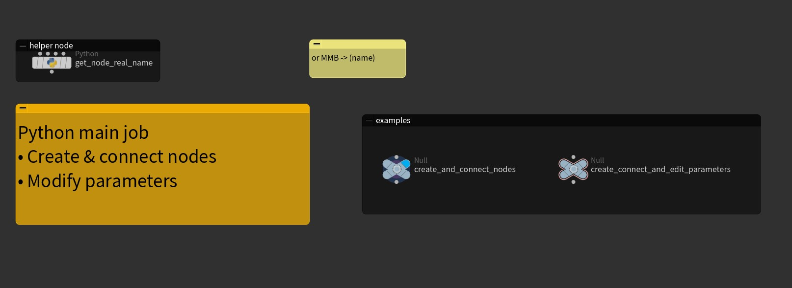
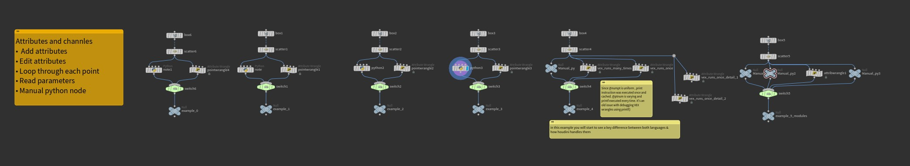
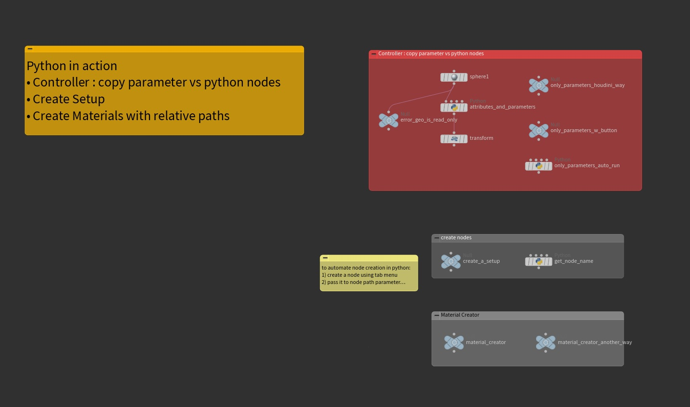

# VEX vs Python 

This tutorial is divided into 4 examples. 
Most of the time, These examples are based on comparison where you learn by achieving the same results in both vex and python and then deducing the difference.

Check this tutorial's [hip file](resources/hip-files/houdini-Scripting.hipnc)

### VEX Note: 
As mentioned in [houdini docs](https://www.sidefx.com/docs/houdini/vex/index.html), VEX is not an alternative to python scripting, but rather a smaller, more efficient general purpose language for manipulating attributes, editing parameters and writing shaders.

## Example 1 Foundations

A walkthrough to learn about `python` and `vex` syntax.  
Some commands in `python` and its `vex` equivalent 

## Example 2 Python main usage

In my opinion, python in houdini has two main uses 
1) To create and connect nodes 
2) To modify parameters of nodes

## Example 3 Attributes & Channels

In this example, I'm exploring how python and vex deal with attributes and parameters. 

## Example 4 Python in action

In this example, I'm exploring 3 exercises that summarize some of my day-to-day Python scripting for houdini

## Bonus 

This tip is very useful when creating your own digital assets or customizing stock nodes in Houdini

- [Customizing stock nodes in Houdini](https://www.toadstorm.com/blog/?p=1012)

    

---

## Further Steps

Cool VEX Snippets: 
- [vex cookbook](https://www.sidefx.com/docs/houdini/vex/cookbook.html)
- [JoyOfVex](https://www.tokeru.com/cgwiki/JoyOfVex)
- [vex isn't scary](https://www.sidefx.com/tutorials/vex-isnt-scary/)

You can find more course about vex and python here: 
To name a few! 

- [SideFx Official](https://www.sidefx.com/learn/)
- [thegnomonworkshop](https://www.thegnomonworkshop.com)
- [fxphd](https://www.fxphd.com/)
- [hipflask](https://www.hipflask.how/)
- [pluralsight](https://www.pluralsight.com/)
- [Linked in learning](https://www.linkedin.com/learning)
- [Udemy](https://www.udemy.com/)

Amazing channels to follow on YT: 
To name a few! 

- [Houdini](https://www.youtube.com/@houdini3d)
- [Adrien Lambert](https://www.youtube.com/@AdrienLambertvfx)
- [Junichiro Horikawa](https://www.youtube.com/@JunichiroHorikawa)
- [Houdini Hangout](https://www.youtube.com/@HoudiniHangout)
- [UTS Animal Logic Academy](https://www.youtube.com/@utsanimallogicacademy2316)
- [Entagma](https://www.youtube.com/@Entagma)
- [Rebelway](https://www.youtube.com/@Rebelway)

Hipfiles libraries:
- [HoudiniBLUEPRINTS](https://hdbp.io/)
- [SideFx Library](https://www.sidefx.com/contentlibrary/)

Houdini Wikis and forums: 
- [odforce](https://forums.odforce.net/)
- [FX TD Wiki](http://fxtd.free.fr/index.php/wiki/)
- [Tokeru cgwiki](https://www.tokeru.com/cgwiki/Main_Page)