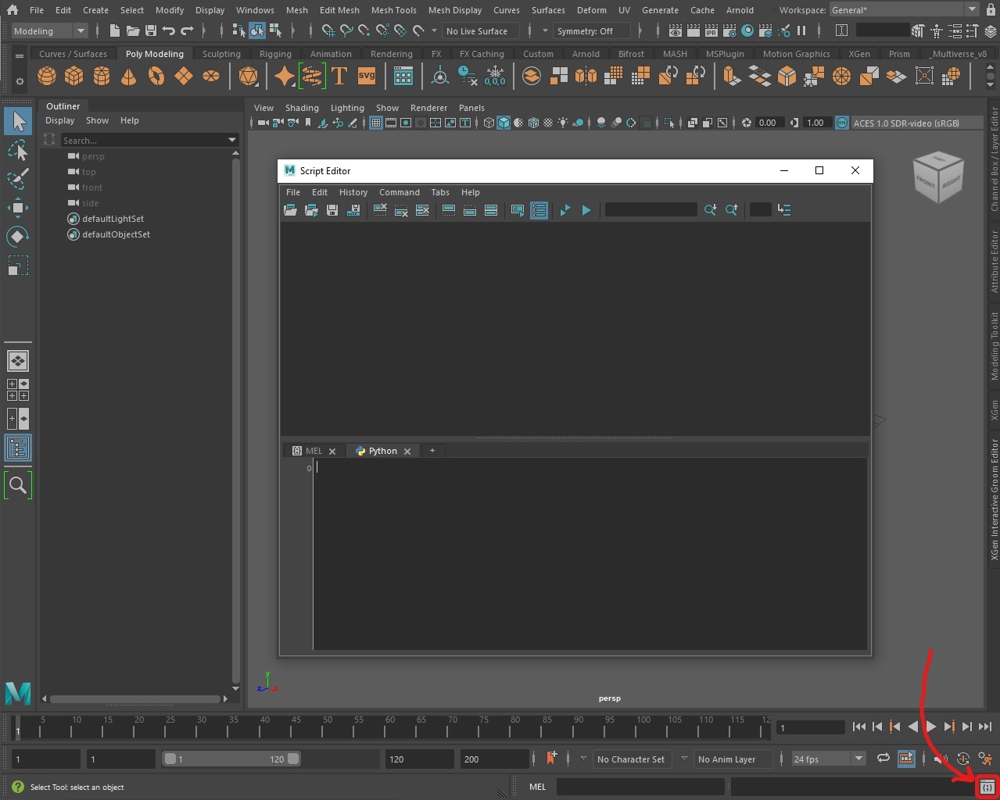

# Maya Scripting Intro

Every action, such as a mouse click or a keyboard key press, fires a command in Maya.

So, Maya scripting is like a shortcut to save time doing things manually.
This results in a higher level of interaction with Maya as the details of doing these things are taken care of by scripts running in the background. 
Think of Maya plugins as an example. 

This guide will be concered with : 
    
- **Mel** (Maya Embedded Language) Commands
- **Python Maya Commands** 

In the next few guides **Script editor** will be our friend, 
Take a moment exploring it! 



## Note: what makes someone a **Maya TD**?

What makes someone a **Maya TD**?, and how is that different from being a developer? 

In my opinion, <br>A **Maya TD** is a Senior Maya artist who is comfortable with scripting.<br>A Senior artist who is familiar with the day-to-day problems facing maya artists, and can give directions on how to solve them. which is the literal meaning of a **TD** (*Technical Director*)! 

This is clearly different than being a developer whose focus is specifically programming, the developer needs guidance from a Maya TD to be able to make things happen.

Therefore, it is a mutual benefit between developers and TDs<br>
TDs can provide directions.<br>
Developers can write code in ways that are better than TDs.<br>

### Example

Problem Statment : 

we need to add a suffix to objects in the outliner to comply with a specific naming convention. 

```
Suffices must be:
    - mesh: _GEO 
    - nurbsCurve: _CRV
    - nurbsSurface: _NRB
    - locator: _LOC
    - null/group: _GRP
```

- Thinking of this problem as a TD, I can utilize **Modify > Search and Replace Names** which is a maya tool to rename selected objects. <br>To speed things up we can use the maya equivalent command, and droping it to shelf.<br><br>Then Artists will be asked to manually select objects and press the equivalent shelf button.

        searchReplaceNames "$" "_GEO" "selected"; // add _GEO suffix
        searchReplaceNames "$" "_CRV" "selected"; // add _CRV suffix
        searchReplaceNames "$" "_NRB" "selected"; // add _NRB suffix
        searchReplaceNames "$" "_LOC" "selected"; // add _LOC suffix
        searchReplaceNames "$" "_GRP" "selected"; // add _GRP suffix

- Thinking of this problem as a developer, I can select object based on their type and then rename them by `cmds.rename`, which is not as simple as it seems as objects names can be messy.


- Thinking of this problem as a developer who gets guidance from a TD, I can upgrade the TD's solution to the next level, you can find code here: [maya_auto_naming](https://github.com/mustafa-zarkash/pipeline-technical-roadmap/blob/main/resources/companion_scripts/openpype/maya_auto_naming.py). 

    *This code detects and filters all objects based on their type while ignoring objects of other types or that have already been named.*
