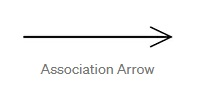
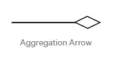
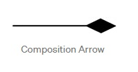
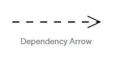
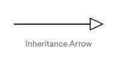
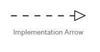

- Association : when a class holds a reference to another class.

    ```
    hometown attribute in Student class is a reference to City class 
    ```

    


- Aggregation : the child can exist independently of the parent.

    ```
    there can be zero or more Students in a Section.

    however, instantiated objects from Student class can exist independently in your code.
    they can be shared or exchanged (but not "owned" by the aggregating Section object).
    ```

    


- Composition  : the child is highly dependent on the other class and together build up a single whole.

    ```
    the Section objects belong exclusively to a course and cannot exist independently.
    ```

    


- Dependency : when a class makes use of another class.

    ```
    A Calculator object can make use of Math class methods.
    ```

    

- Inheritance : when one class inherits from another class.

    ```
    Rectangle class inherits Shape class
    you can instantiate objects from Shape class as well. 
    ```
    
    


- Implementation : when one class inherits from an abstract class.

    ```
    Both Human and Dog classes inherit Mammal class 
    however, you can't instantiate objects from Mammal class! 
    ```

    

    

---
## Links 

- [UML Class Diagrams](https://taylorial.com/oo/uml/)
- [UML Class Diagram Tutorial](https://www.visual-paradigm.com/guide/uml-unified-modeling-language/uml-class-diagram-tutorial/)

