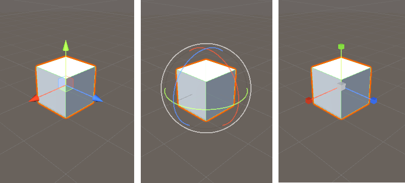

# Get started with Unity

These files are summary of Unity's official [Get started tutorial](https://learn.unity.com/pathway/unity-essentials). 

- 01-Unity-getting-started.md
- 02-Explore-Unity.md
- 03-Learn-Unity.md

### Points: 

- Install the Unity Editor for the first time. 
- Explore the Unity Editor using a new user Microgame.
- Identify and use essential features of the Unity Editor. 
- Navigate in 3D space in the Scene view. 
- Create and manipulate GameObjects. 
- Create and manage Scenes.
- Create and manage projects in the Unity Hub.
- Build and share a project on Unity Learn. 
- Identify the key elements of the Unity Learn ecosystem, and their purpose.

This guide is made to be used side by side the official tutorial, so that kids can get the full experience. 

---

## Get ready for Unity Essentials

1) Install Unity.
2) In `Unity Hub/ New porject/ Learning`, and explore game templates types.
3) Pick a game, set project name, and set project location.
4) Play the game and explore its `Assets`, UI tabs. 
5) Analyse the game, and tell your thoughts about how to make it better.
   - score 
   - lives 
6) answer quiz 
   

[//]: <> "choose a micro game and cusomize scene,e.g. LEGO "

## Inspiration and Motivation. 

1) Explore what [made with Unity](https://unity.com/made-with-unity)
2) Why learn Unity?
    - Simple  and Easy
    - Community and resources 
    - Flexible like playing with LEGO
    - can export game to many platforms 
3) What do you think Unity will allow you to do? 
4) What do you want to create?
5) Mindsets: Approaches to success
    - Teach yourself how to learn
    - Things take time, and if you rush things they won't came out the way you want it to.
    - Stay focus on your idea. 
    - If you want to celebrate the way you success, you need to accept the way you fail
    - Be willing to test a lot! 
6) Prerequisite skills
    - Art 
    - Programming 
    - Game Design
7) Unity Learning Ecosystem: 
    - [Unity Microgames](https://blogs.unity3d.com/2020/09/09/create-your-first-game-brick-by-virtual-brick-with-the-lego-microgame/)
    - [Learn tab in Unity Hub](https://docs.unity3d.com/hub/manual/Learn.html)
    - [Unity Documentation](https://docs.unity3d.com/Manual/UnityManual.html)
    - [Unity Forums](https://forum.unity.com/)
    - [Unity YouTube](https://www.youtube.com/user/Unity3D)
    - [Unity Blog](https://blog.unity.com/)
8) First Practice: 
    - Install Unity on your own 
    - Download a game, play it, and note your thoughts. 

## Explore the Unity Hub

1) Explore Tabs 
2) Account Settings
3) Project's gear icon > add module 

## Explore the Unity Editor

Start with empty 3d template 
- Create a new 3D project and scene.
- Create new 3D GameObjects.
- Identify the windows of the Unity Editor.
- Understand the role of scenes in organizing your projects.
- Navigate in a scene to change your view.

### [Explore Unity Editor](https://learn.unity.com/tutorial/explore-the-unity-editor-1) 

- Default 3D Scene 
  - Main Camera
  - Directional Light, which simulates the sun 
 
- Interface 
    - Scene view and Game view
    - Hierarchy window, and GameObjects.
    - Project window, Assets available to your entire project. 
        > You can drag assets directly from the Project window into the Scene view to add them to the scene. 
    - Inspector window
        > When you select a GameObject in Scene view or in the Hierarchy, you’ll see its components in the Inspector.
    - Toolbar
        > change your point of view in the scene, and start and stop Play Mode. 
    
- Navigation in Scene view  
    > navigating in this window is like operating a drone camera

    - **Orbit**: Alt + Left-Click and Drag
    - **Pan**: Alt + Middle-Click + Drag
    - **Zoom**: Alt + Right-Click and Drag
    - **Focus**: F
    - **Flythrough mode**: Right-Click and 
        - **WASD** : to move the view left/right/forward/backward.
        - **Q** and **E** : to move the view up and down.
        - hold **Shift** to move faster.
    
- Review the tools : 
    > In the Hierarchy window and select **3D Object** > **Cube**

    <table border="0">
    <tr>
    <td></td>
    <td> <ul  style ="line-height: 27px;">
        <li><b>Q</b>: Hand tool, to pan your view</li>
        <li><b>W</b>: Move tool, to select and change position</li>
        <li><b>E</b>: Rotate tool, to select and rotate</li>
        <li><b>R</b>: Scale tool, to select and change size</li>
        <li><b>T</b>: Rect Transform tool, to scale in 2D</li>
        <li><b>Y</b>: Transform tool, to move, scale, and rotate with one Gizmo</li>
    </ul> </td>
    </tr>
    </table> 

    

## Asset Store Vs. Package Manager 

Asset Store: **Window** > **Asset Store**  which forwards you to the [online Asset Store](https://assetstore.unity.com/)

    Asset Store is an online library for unity assets that were premade and ready to use in your project whether free assets or paid assets

Getting your first asset. 

- [Starter Assets - Third Person Character Controller](https://assetstore.unity.com/packages/essentials/starter-assets-third-person-character-controller-196526)

    

Package Manager: **Window** > **Package Manager**  

    Package Manager is used to manage 
        Unity packages (e.g. WebGL Publisher)
        Assets (e.g. to import the asset we previously got from store) 

Packages are filtered based on the package scope drop-down menu  
- Package scope drop-down **Packages: In Project** 

## Challenge 

Build a whitbox scene from your imagination, add `Third Person Character` asset to your project, and then play your scene. 

you may want to check [types of light](https://docs.unity3d.com/Manual/Lighting.html). 

### Why whitebox scenes are usefull? 
To speed up game production cycle. 
In a prototype of a game, a colleague is modeling the enemy character while you work on gameplay. Your placeholder for the enemy is a capsule primitive. When the enemy is ready to import, you then simply replace the capsule object with the new model.