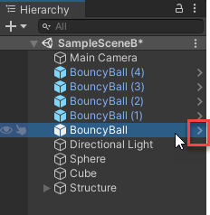
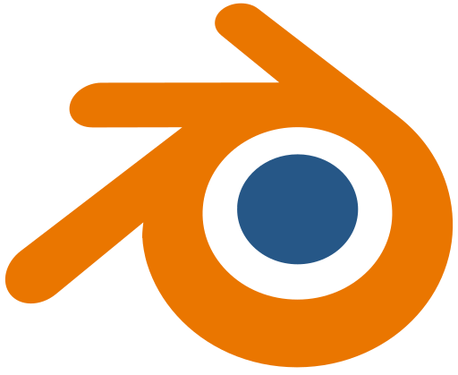
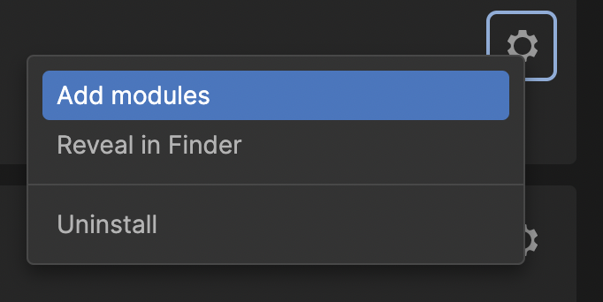
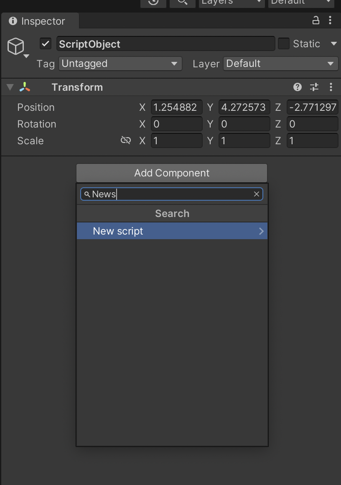

# Explore Unity

In this section we will : 

- Learn about different roles of Unity creations 
- Create simple 2D and 3D experiences 
  

## Real-time creation 
Objective
By the end of this learning project you will be able to:

- Real-time creation and creation tools.
- what the Unity real-time engine does.
- Identify the industries and applications for real-time creation.

### What is real-time?

A discussion about:  
    
> Offline rendering vs Real-time rendering <br>Movies Grpahics vs Games Graphics <br>non-interactive media vs interactive media<br>

Rener Engines can utilize `Render Farms` to achieve high quality realistic image, as it needs a lot of time to be calculated also a lot of resources like CPU, GPU and RAM! 

The goal of real-time software is to render images so quickly that a person can freely interact with the project without any noticeable delay by compromising render quality for render time. 

Real-time Rendereing allow creators to expriment new things much much faster as it can remove weeks or months from the production cycle.

**RenderMan Offline Renderer**<br>
[](https://renderman.pixar.com/product)

**Avatar way of water | RenderMan**<br>
[](https://www.wetafx.co.nz/films/filmography/avatar-sequels/)

**The Heretic short film | Unity** A short film created in Unity using out-of-the-box features.<br>
[](https://www.youtube.com/watch?v=iQZobAhgayA)

**Enemies – real-time cinematic teaser | Unity**<br>
[](https://www.youtube.com/watch?v=eXYUNrgqWUU)

### What is Unity?
Unity began its life as a game engine but evolved to be a creative tool that’s used by many different industries.

### What is a game engine?
A game engine is the point of convergence for all components that go into making a game.
- It can render 3d models and 2d sprites
- It can play audio.
- It can handle keyboard and mouse clicks events.
- It has a physics engine! (e.g. if you add force to a ball, it will calculate the ball's speed and position.)  


Inside a game engine, you don’t create assets. Instead, assets are created in specialized external programs called Digital Content Creation (DCC) tools.

>  you don’t have to build every asset in your projects from scratch.<br> Hundreds of ready-to-use assets created with DCCs are available to you through the Unity Asset Store.


### What can Unity do?

Unity is not limited to any specific industry — any industry that needs to create content, especially interactive content.

- Games 
- XR Experience (Virtual, Augmented, and Mixed Reality) 
- Media and Entertainment (Movies)
- Virtual Production 

## Essentials of real-time 3D

- Unity Editor UI
- Create Objects 
- Organize Hierarchy
- Adjust Lighting 
- GameObject Components
  - RigidBody
  - Materials
- Prefabs and Prefab variants.


We previously examined Unity's UI.


### Organize GameObjects in the Hierarchy

you can add multplie **3D Objects** and group them under **EmptyObjects**.

*EmptyObject is an object that only has transform component.*


### Components

- RigidBody 
    

- Materials 
    - Visual Material: which affect visual properties like color 
      - Create a folder for materials in **Project Window** right-click, and **Create** > **Folder**
      - Create a material **Create** > **Material**
      - Drag and drop to assign materials 
      - Texture Map : an image file, such as a PNG or JPG, that you apply to a material.
          
        - Double click circle icon to assign a texture
        - Adjust **Tiling** **X** and **Y** to scale the texture
      
  - Pyhsical Material: which affect physical properties like Bouncy and friction 
    - **Create** > **Physic Material**

### Prefabs

A prefab is an asset that acts as a template of a GameObject. From the prefab, you can create multiple copies, called instances. A change to the prefab asset causes all of its instances to change as well.

- Create a folder for **Prefabs** 
- Drag object from **Hierarchy** to the **Prefabs** folder
- Objects copied from prefabs are colored blue

    

- Prefab mode to edit a prefab, **It will affect all copies in sceneview!**
    <table border="0">
    <tr>
    <td><p>Enter Prefab mode </p></td>
    <td><p>Exist Prefab mode </p></td>
    </tr>
    <tr>
    <td> </td>
    <td></td>
    </tr>
    </table>

- Prefab Override: when you change one prefab instance
  
    - Overrides dropdown menu 

        

    - Override actions 
            
        

- Prefab Variants: which are prefabs based on other prefabs. 
    
    After making overrides, drag and drop to the **Prefabs** folder

    

- Nested prefabs: when making a complex prefab from smaller prefabs.

### Get 3D assets 

- Create and Edit in 3D DCCs 
  -  Maya 
  -  Blender
  -  Houdini 
- Create in Unity (probuilder)
- Download from Internet 
- Download from Asset Store

### Challenge 

Build a scene and playtest

### Publish your project

- Before building: (e.g. project as WebGL) 
  - The WebGL Build Support: **Unity Hub** > **Projects** > **Editor Version**
  - The WebGL Publisher package: **Window** > **Package Manager** > **WebGL Publisher**

- Build : 
  - **File** > **Build Settings**
  - Select/ Switch Platform 
  - Select Player Settings
  - **Build Settings** for more advanced settings 

- Publish button : uploads your build to the Unity website

- Share your project 
  - [Submitted Games](https://learn.unity.com/tutorial/publish-your-project#63753f42edbc2a3b09474bcf)


## Essentials of programming in Unity

In the Unity Editor, you can customize the properties and behaviors of GameObjects by writing custom scripts in the C# language. 

### Script Editor

Set your preferred IDE or Script Editor 

 - **Edit** > **Preferences** > **External Tools** <br>In my case I prefer **Viusal Studio Code** 
    

Instead, You can use **Visual Studio**   which has much more tools than **Visual Studio Code**  

To add **Visual Studio**  module to your Unity:




### Your first script

- Scripts in unity like any other componants 
- Create one and double click it, I perefer to move it to **Scripts** folder to keep project organized. 

  

you can start editing by adding 

```
Debug.Log("Hello World");
```


It will print "Hello World" to your consol window in Unity when pressing ▶ play button 


### Start Vs. Update 

Use this line of code  instead. 
Try it in both functions `Start` and `Update` and note your thoughts. 

```
Debug.Log($"Hello World {Time.frameCount}");
```


you can start learning about programming from [here](https://docs.google.com/presentation/d/1DNO-HUGzn1xE0L01GhmeS09VyOvu3XqQMCQlSiRYNpw/edit?usp=sharing)

[//]: <> "This link was added temporarily till I make another summary md file"

### Add a property with a variable

public variables appear like a property in your script component 


### Unity's API

Access transform component 
```
public Vector3 scaleChange;

transform.position += value ;
transform.localScale += value ; 
transform.Translate(value); 
transform.Rotate (value);
```

Code Snippet for basic movement : 

```
if (Input.GetKey(KeyCode.UpArrow)){  
    transform.Translate(0f, 0f, 0.01f);  
}  
if (Input.GetKey(KeyCode.DownArrow)){  
    transform.Translate(0f, 0f, -0.01f);  
}  
if (Input.GetKey(KeyCode.LeftArrow)){  
    transform.Rotate(0f, -0.1f, 0f);  
}  
if (Input.GetKey(KeyCode.RightArrow)){  
    transform.Rotate(0f, 0.1f, 0f);  
} 
```

you can use `Bolt` for visual scripting. <br>
you can get pre-made scripts from `Asset Store` or from Internet. 


## Essentials of real-time audio

### Add Audio to Unity Scene 
- Drag Audio files to your **Project Window**
- Create EmptyObject 
- Add component Audio Source
   
- Select Audio Clip 
  
- Unmuted Audio when in Play Mode.
  
- If you still do not hear any music playing, make sure the Play On Awake setting in the Audio Source Component is enabled. 

### 3D sound
In 3D audio, Audio Clips sound differently depending on your location.

It's achieved by **Audio Listener** Component.<br>
only one Audio Listener can be in a Scene!<br>
So, It's attached to the Main Camera, so the user’s “eyes” and “ears” are together.  

- Add **Audio Listener** Component
   

- Create 3D Audio 
  - Enable **Loop**
  - Set **Spatial Blend** to **1**
  
  

- Control Audio **rolloff**
  -  Set **Min Distance** and **Max Distance**
  -  Set Roll off Curve 

  
   
  Visual representaion of **Min Distance** and **Max Distance** in scene view
  

### Get Audio 

- Download audio clips: 
  - [freesound](https://freesound.org/)
  - [Incompetech](https://incompetech.com/music/royalty-free/music.html)
  - [Asset Store](https://assetstore.unity.com/?category=audio&free=true&q=music&orderBy=1)

- Create and Edit in Audio DCCs
  - [ Audacity ](https://www.audacityteam.org/)
  - [ Reaper ](https://www.reaper.fm/)

  - In Audio DCC, you can 
    - Record and compose music 
    - Clean up recordings 
    - Add filters and effects 
    - Optimize audio


## Essentials of real-time 2D

 GameObjects in 2D Scenes are called Sprites which are typically imported images.

## 2D Scenes and Sprites

Start with empty 2d template 
- Create a new 2D project and scene.
- Create new 2D GameObject **2D Object** > **Sprite**.
  > It will become visible once you assign an image to it.
- Edit **Sprite Renderer** component to assign an image. 
  

- you can add **Rigidbody 2D** to add mass
  


### RigidBody vs. Collider

RigidBody properties control how the GameObject interacts with gravity and air density.

The Collider Component adds additional properties that determine how objects interact with each other.

In this scene : 
- **Circle Sprite** which has 
  - **RigidBody 2D** component: so that it falls when ▶ is pressed
  - **Circle Collider 2D** component: so that it doesn't pass through plane 
- **Plane Sprite** which has
  - **Box Collider 2D** component: to make it interactable


### Get 2D assets 
- Create and Edit in 2D DCCs
  -  Photoshop 
  -  Illustrator 
  -  Substance Painter 
- Create in Unity (2D Tilemap Editor, Sprite Editor)
- Download from Internet 
- Download from Asset Store

## The real-time industry

### Production Cycle


- Pre-production: *Making all major decisions*
    
      Planning, Prototyping, Pipeline setup, and Initial designs.
      For a film or animation, a script and storyboards.
      For a game, a game design document which includes information about the story, gameplay, art direction, intended target audience and accessibility.

- Production
        
      The creation of final 2D images and 3D models, audio, lighting, and user experience.
- Post-production
  
      quality assurance (QA), editing, testing, bug fixing, and final polishing.
- Operations 
   
      sales, Support, monetization, Analytics, updates, and continued server and website maintenance.

      The operations phase continues as long as the product is on the market. 


### Exercise I 

Imagine your studio is making a game, an animation, or a simulation using a real-time editor like Unity — but you decide to skip pre-production entirely and jump right into production. Imagine a disaster scenario that could have been avoided if you had taken necessary time in pre-production.  How could pre-production have solved these problems? 

### Version control

To keep track of every modification to the many files in a project so that you can track your progress and go back to earlier versions as needed.

Control Systems: 
- Github
- Unity’s Collaborate
- PlasticSCM

A version control system is used to: 
- Track where changes to the project have been made over time.
- Revert back to a previous version of the project, if necessary.
- Manage contributions from all team members. 

### Exercise II 

Choose two job titles listed above that you would be most interested in. Search online for job openings in both roles at a company you think would be fun to work for. As you research, answer the following questions: 

- What does it take to get these jobs? 
- How do your current skills match up with those requirements? 
- What skills do you need to learn? 
- After reading the job description, are you still interested? 
- Are there any other positions you discovered that you are more interested in than you were before?

Did you discover anything surprising during this research? If so, share what you found in the comments.

### Testing 

- **Alpha Testing**: 
    
      It is performed in-house to identify issues and areas for improvement.

- **Beta Testing** 
 
      It is carried out by potential end-users in the expected environment where the product will be used.
### Exercise III

With all of the bugs and feature requests that emerge during post-production, what do you think is the best way to prioritize them? How would you decide which ones to address first, or which not to address at all? For example, what if there was a bug that might make the experience 5% worse and a feature request that would definitely make the experience 50% better? Do a bit of online research to see if you can figure out how studios prioritize their post-production issues.

If you discovered any interesting strategies or anecdotes, share them in the comments.

### Exercise IV

After hearing about all of the phases of production (pre-production, production, post-production, and operations), which do you think would be the most interesting to work in? Share your opinions in the comments.


### Unity throughout production

- **Pre-production**, to create concepts, prototypes, or visualize camera angles.
- **Production**, to create the project itself in a real-time environment, integrating art, audio, and code. 
- **Post-production**, to test the overall functionality, analyze and optimize project performance, and export for various mediums and platforms.
- **Operations**, to monetize the product through advertising and in-app purchases, address ongoing bug fixes, and push updates to improve or expand upon the product.

### Roles and careers 

- **Art and Design**: creating the look, sound, and feel of the project with modeling, animation, lighting, audio, and other effects 
- **Programming**: creating the functionality of the project, including gameplay, networking, and artificial intelligence

### Careers in Art and Design

- **3D artist**: create 3D objects and backgrounds; optimize graphics performance
- **2D artist**: create 2D objects and backgrounds; optimize graphics performance; create storyboards and concept images
- **Lighting artist**: develop optimized lighting effects; create post-processing effects such as bloom, ambient occlusion, depth of field, and color correction
- **Audio designer**: create and implement sound effects, voice overs, and music
- **Character artist**: sculpt and model characters and their assets such as hair, accessories, armor, and weapons
- **Technical artist**: work with artists and programmers to implement their work within the final product
- **Visual Effects artist**: create realistic and stylized visual effects, such as lava, smoke, and fire; implement physical properties such as collisions and falling
- **Animator**: create and optimize high-quality animation of all moving characters and objects; ensure that lighting and visual effects operate well in motion
- **Game / Level Designer**: construct and implement gameplay; conduct playtesting and implement feedback; validate playability with the testers, level artists, and gameplay programmers

### career path in Art and Design


### Useful non-technical skills in Art and Design

- Research and analysis: how to identify your audience
- Collaboration: how to work well on a team
- Communication: how to express your ideas clearly, and feedback to others.

### Exercise V
Do some research on Google and LinkedIn to find at least two profiles of professionals working at a senior or director level in Art and Design at a company you admire. Track their job titles from the start of their career to now. What is similar in the paths they took? What is unique?

If you discovered any particularly helpful patterns, share them in the comments.

### Careers in Programming

For [more details](https://connect-prd-cdn.unity.com/20201012/98be0570-6f5b-4983-967f-264fb3ad6930/Careers%20in%20Programming.pdf)

- **Quality assurance technician**: find and report bugs; write test cases and plans
- **Programmer analyst**: write code based on documented design; modify applications to maintain functionality
- **C# developer**: develop new features and applications; manage the release of products 
- **Unity engineer**: develop new features and applications using Unity
- **Research engineer**: design, implement, analyze, and optimize state-of-the-art algorithms
- **Software developer**: design, develop, test, and release new features and tools
- **VR / AR developer**: prototype and build next generation VR/AR products; deploy and maintain VR/AR applications; stay current on the latest trends in VR/AR
- **Mobile developer**: develop new mobile features and applications; stay current on mobile technologies 
- **UI / interface programmer**: code user interfaces to meet the intent of the project's design and flow; integrate UI systems into features
- **Gameplay programmer**: analyze and understand the game design documents; develop gameplay systems such player’s action, character’s behavior, game elements, and game progression

### career path in Programming


### Useful non-technical skills in Programming

- **Critical thinking and problem solving**: looking for problems users are facing and opportunities to deliver more value to your users;
- **Communication**: expressing your ideas clearly; providing actionable and constructive feedback in code reviews
- **Collaboration**: listening to understand the ideas of others; receiving feedback; working well on a team  

### Exercise VI

Do some research on Google and LinkedIn to find at least two profiles of professionals working at a senior or director level in programming at a company you admire. Track their job titles from the start of their career to where they are working currently. What is similar in the paths they took? What is unique? 

If you discovered any particularly helpful patterns, share them in the comments.

### Careers as a generalist

Unity generalists are comfortable working with both art and code, integrating them into a Unity project, optimizing project performance, and publishing a product for its target platform.

Unity generalist can be an appealing goal if you want to work alone or in small teams.

### Useful non-technical skills in to generalists

- **Project management**: organizing and planning across platforms, tools, styles, formats, and digital media in order to deliver your product.
- **Research and Analysis**: planning, researching, and curating information from a variety of sources to inform creative decisions. 
- **Critical thinking and problem solving**: identifying strategies to understand problems, and solve them, and test proposed solutions.

### Indie games

which were made by one man team or small teams.

[](https://www.youtube.com/watch?v=UjzErwYntFs)

### What will be your path?

Hopefully, you're starting to get an idea of what you'd like your job to be like.

Deciding on a specialty, or deciding to become a generalist, can take time, whether it’s in school, in your career, or in Unity.  You might even change your mind later in the journey.

so, I encourage you to fasten your seatbelt and start enjoying the journey, and remember there are no wrong decisions as long as you learn.

Watch Unity Videos about: [What will be your path?](https://learn.unity.com/tutorial/roles-and-careers-for-real-time-creators?uv=2021.3&pathwayId=5f7bcab4edbc2a0023e9c38f&missionId=5f777d9bedbc2a001f6f5ec7&projectId=5fa45d4aedbc2a001f019348#5fa45eb7edbc2a01f0fb2c4b)


## Challenge 1 

  Make a 3d Scene with sounds and visual effects.<br>
  Add elements like: 
  - Background music 
  - Sounds that come from game objects 
  - Steam 
  - Dramatic lighting 


## Challenge 2 

  Make a 2d Scene with sounds and visual effects.<br>
  Add elements like: 
  - Background music 
  - Sounds that come from game objects 
  - Steam 
  - Dramatic lighting 