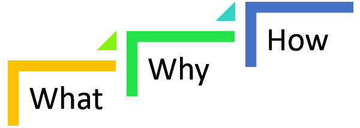
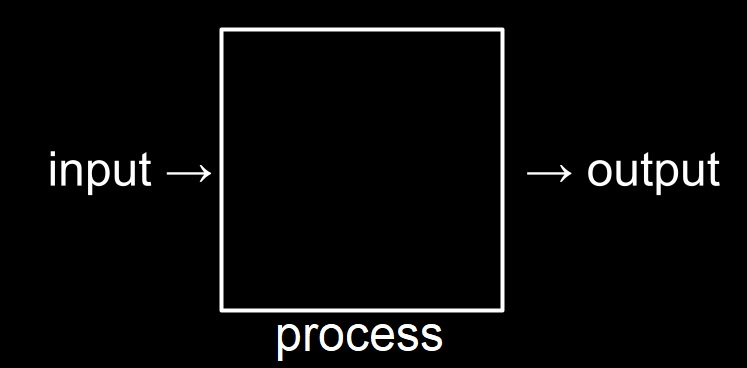
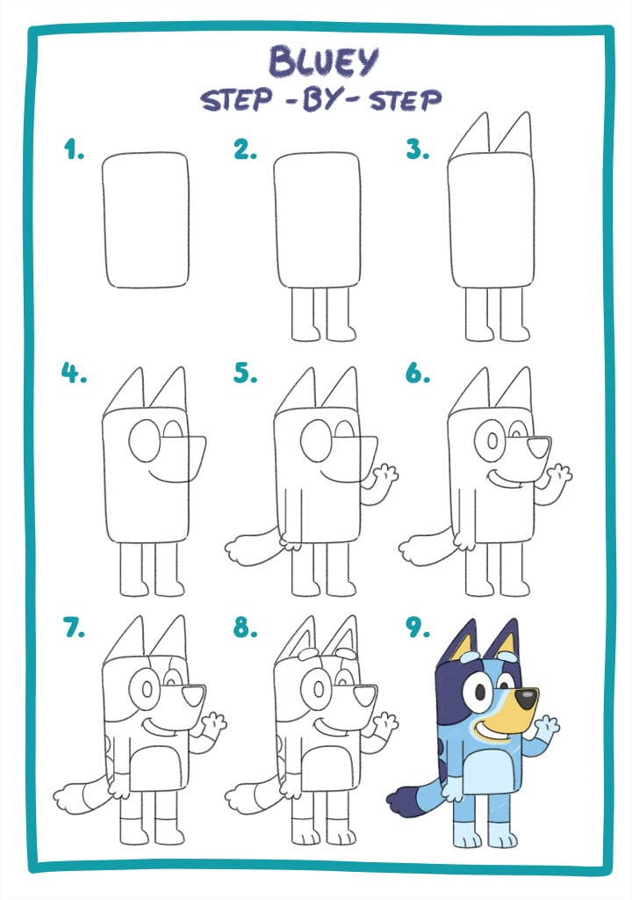

# Programming Introduction
It's more about making a good plan than being clever, [read more](https://microcredentials.digitalpromise.org/explore/planning-before-programming).

## Preparation 

- Install VS Code
- My daily workflow using python  
  - Python files
  - Run in CMD
  - Markdown documentations

## Programming Process 

1) Identidy problem you want to solve in code
2) Answer the **What, Why and How** questions 
     - what is the problem you are trying to solve ? (*answer in 1 sentence*)
     - Why you want to solve this problem ? 
     - How will you solve it ? 

    

3) Solution planning

   - Take a moment and think about the problem you are solving, recognize its inputs and the desired outputs, and then think about the process/solution that will transform the inputs to outputs. 

      
       image credits CS50
    
   - Then do some pre-coding activities which include writing problem statements and mapping out solutions using storyboards, pseudocode, or flowcharts.

   - You can Google "storyboards", "pseudocode", or "flowcharts" to learn more about them.

4) Code Planning
 
    Where you start to break into writing code
    There are two possible ways
      1) Abstraction (Imagine as a whole), [*check code*](resources/02-programming-intro/abstraction.py)
        
         image credits [clipstudio](https://www.clipstudio.net/how-to-draw/archives/160863)

      2) Continuous development (piece-by-piece), [*check code*](resources/02-programming-intro/continuous-development.ipynb)
        
         image credits [bluey.tv](https://www.bluey.tv/make/how-to-draw-bluey/)

### Problem 1 

Not set yet.

### Problem 2 

Search the internet to find a problem of your choice and then solve it.

### More problems 

Consider sites like [edabit](https://edabit.com/challenges)

---

## Further Steps 

- To learn more about computer science, consider starting with [CS50](https://pll.harvard.edu/course/cs50-introduction-computer-science) 

  

- To learn more about python, consider courses like: 
  - [Programming for Everybody | Coursera](https://www.coursera.org/learn/python)
  - [The Python Mega Course | Udemy](https://www.udemy.com/course/the-python-mega-course)